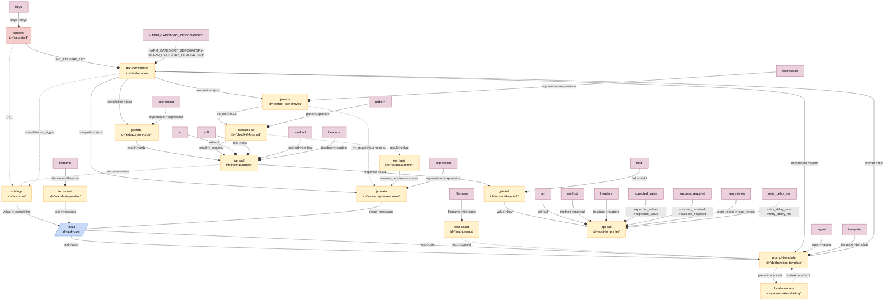

# Coffe Bot

```mermaid
%%{init: 'themeVariables': { 'fontFamily': 'Fira Code, monospace' }}%%
graph TD;
secrets1("secrets
id='secrets-1'"):::secrets -- "API_KEY->API_KEY" --o deliberation["text-completion
id='deliberation'"]
secrets1("secrets
id='secrets-1'"):::secrets -. "_->_" .-> noorder["not-logic
id='no-order'"]
noorder["not-logic
id='no-order'"] -- "value->_something" --> askuser[/"input
id='ask-user'"/]:::input
loadfirstquestion["text-asset
id='load-first-question'"] -. "text->message" .-> askuser[/"input
id='ask-user'"/]:::input
askuser[/"input
id='ask-user'"/]:::input -- "text->user" --> deliberationtemplate["prompt-template
id='deliberation-template'"]
askuser[/"input
id='ask-user'"/]:::input -- "text->user" --> deliberationtemplate["prompt-template
id='deliberation-template'"]
loadprompt["text-asset
id='load-prompt'"] -. "text->context" .-> deliberationtemplate["prompt-template
id='deliberation-template'"]
deliberationtemplate["prompt-template
id='deliberation-template'"] -- "prompt->context" --> conversationhistory["local-memory
id='conversation-history'"]
deliberationtemplate["prompt-template
id='deliberation-template'"] -- "prompt->text" --> deliberation["text-completion
id='deliberation'"]
handleorders["api-call
id='handle-orders'"] -. "success->value" .-> noorder["not-logic
id='no-order'"]
deliberation["text-completion
id='deliberation'"] -- "completion->json" --> extractjsonmoves["jsonata
id='extract-json-moves'"]
deliberation["text-completion
id='deliberation'"] -- "completion->agent" --> deliberationtemplate["prompt-template
id='deliberation-template'"]
deliberation["text-completion
id='deliberation'"] -- "completion->json" --> extractjsonorder["jsonata
id='extract-json-order'"]
deliberation["text-completion
id='deliberation'"] -- "completion->json" --> extractjsonresponse["jsonata
id='extract-json-response'"]
extractjsonmoves["jsonata
id='extract-json-moves'"] -. "_->_require-json-moves" .-> extractjsonresponse["jsonata
id='extract-json-response'"]
deliberation["text-completion
id='deliberation'"] -. "completion->_trigger" .-> noorder["not-logic
id='no-order'"]
extractjsonorder["jsonata
id='extract-json-order'"] -- "result->body" --> handleorders["api-call
id='handle-orders'"]
extractjsonmoves["jsonata
id='extract-json-moves'"] -- "moves->texts" --> checkiffinished["contains-str
id='check-if-finished'"]
checkiffinished["contains-str
id='check-if-finished'"] -- "result->_required" --> handleorders["api-call
id='handle-orders'"]
checkiffinished["contains-str
id='check-if-finished'"] -. "result->value" .-> nomovefound["not-logic
id='no-move-found'"]
nomovefound["not-logic
id='no-move-found'"] -- "value->_requires-no-move" --> extractjsonresponse["jsonata
id='extract-json-response'"]
extractjsonresponse["jsonata
id='extract-json-response'"] -- "result->message" --> askuser[/"input
id='ask-user'"/]:::input
handleorders["api-call
id='handle-orders'"] -- "response->data" --> extractkeyfield["get-field
id='extract-key-field'"]
extractkeyfield["get-field
id='extract-key-field'"] -- "value->key" --> waitforprinter["api-call
id='wait-for-printer'"]
conversationhistory["local-memory
id='conversation-history'"] -. "context->context" .-> deliberationtemplate["prompt-template
id='deliberation-template'"]
filenameloadfirstquestion[filename]:::config -- "filename->filename" --o loadfirstquestion
filenameloadprompt[filename]:::config -- "filename->filename" --o loadprompt
agentdeliberationtemplate[agent]:::config -- "agent->agent" --o deliberationtemplate
templatedeliberationtemplate[template]:::config -- "template->template" --o deliberationtemplate
keyssecrets1[keys]:::config -- "keys->keys" --o secrets1
HARM_CATEGORY_DEROGATORYdeliberation[HARM_CATEGORY_DEROGATORY]:::config -- "HARM_CATEGORY_DEROGATORY->HARM_CATEGORY_DEROGATORY" --o deliberation
expressionextractjsonresponse[expression]:::config -- "expression->expression" --o extractjsonresponse
expressionextractjsonorder[expression]:::config -- "expression->expression" --o extractjsonorder
expressionextractjsonmoves[expression]:::config -- "expression->expression" --o extractjsonmoves
fieldextractkeyfield[field]:::config -- "field->field" --o extractkeyfield
urlhandleorders[url]:::config -- "url->url" --o handleorders
url2handleorders[url2]:::config -- "url2->url2" --o handleorders
methodhandleorders[method]:::config -- "method->method" --o handleorders
headershandleorders[headers]:::config -- "headers->headers" --o handleorders
patterncheckiffinished[pattern]:::config -- "pattern->pattern" --o checkiffinished
urlwaitforprinter[url]:::config -- "url->url" --o waitforprinter
methodwaitforprinter[method]:::config -- "method->method" --o waitforprinter
headerswaitforprinter[headers]:::config -- "headers->headers" --o waitforprinter
expected_valuewaitforprinter[expected_value]:::config -- "expected_value->expected_value" --o waitforprinter
success_requiredwaitforprinter[success_required]:::config -- "success_required->success_required" --o waitforprinter
num_retrieswaitforprinter[num_retries]:::config -- "num_retries->num_retries" --o waitforprinter
retry_delay_mswaitforprinter[retry_delay_ms]:::config -- "retry_delay_ms->retry_delay_ms" --o waitforprinter
classDef default stroke:#ffab40,fill:#fff2ccff,color:#000
classDef input stroke:#3c78d8,fill:#c9daf8ff,color:#000
classDef output stroke:#38761d,fill:#b6d7a8ff,color:#000
classDef passthrough stroke:#a64d79,fill:#ead1dcff,color:#000
classDef slot stroke:#a64d79,fill:#ead1dcff,color:#000
classDef config stroke:#a64d79,fill:#ead1dcff,color:#000
classDef secrets stroke:#db4437,fill:#f4cccc,color:#000
classDef slotted stroke:#a64d79
```
